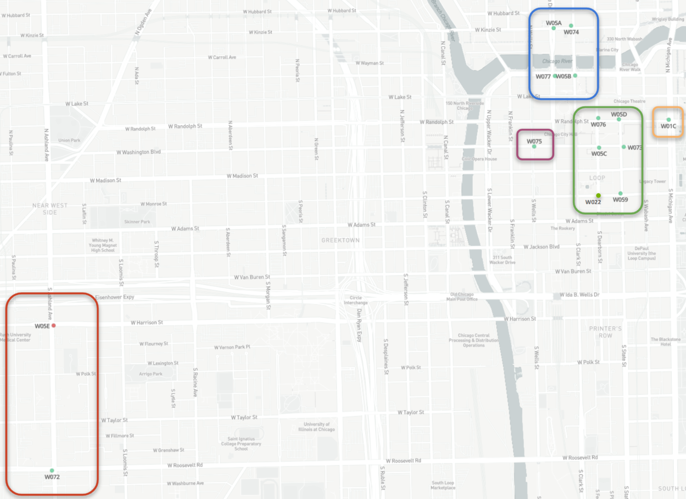

# PANDAWNOps Website

This repository contains the public website for **PANDAWNOps**: a city-scale intelligent sensing research platform for multi-sensor, domain-aware radiological/nuclear detection in urban environments.

The site is hosted using **GitHub Pages** at:

<https://dawn-panda.github.io/>

## Repository Structure

```text
.
├── index.html              # Homepage / About page
├── network.html            # PANDAWN network overview
├── data.html               # Data streams, labels, endpoints, and roadmap
├── platform.html           # PANDAWN platform and AI@Edge system
├── privacy.html            # Privacy, compliance, governance, and review information
├── publications.html       # Publications and related outputs
├── team.html               # Project team page
├── css/
│   └── style.css           # Shared site-wide CSS
└── images/
    └── ...                 # Maps, node images, deployment photos, and other graphics
```

## Editing the Website

This is a static HTML/CSS website. Each page is edited directly as an `.html` file.

Common edits:

- Edit homepage content in `index.html`
- Edit network/map content in `network.html`
- Edit data products and data access information in `data.html`
- Edit platform/node information in `platform.html`
- Edit privacy, compliance, HSR, and communication-plan content in `privacy.html`
- Edit styling in `css/style.css`
- Add or replace images in the `images/` folder

## Navigation Bar

Each page includes a navigation block similar to:

```html
<nav>
  <a href="index.html" class="nav-brand">PANDAWN<span>ops</span></a>

  <button
    class="nav-toggle"
    onclick="this.classList.toggle('open'); document.querySelector('.nav-links').classList.toggle('open');"
    aria-label="Menu"
  >
    <span></span>
    <span></span>
    <span></span>
  </button>

  <ul class="nav-links">
    <li><a href="index.html">About</a></li>
    <li><a href="network.html">Network</a></li>
    <li><a href="data.html">Data</a></li>
    <li><a href="platform.html">Platform</a></li>
    <li><a href="publications.html">Publications</a></li>
    <li><a href="privacy.html">Policy &amp; Compliance</a></li>
  </ul>
</nav>
```

For each page, set the current page link to `class="active"`.

Example for `data.html`:

```html
<li><a href="data.html" class="active">Data</a></li>
```

Only one navigation link should have the `active` class on a given page.

## Page Section Pattern

Most pages use the following section structure:

```html
<section class="alt section-name">
  <div class="section-inner">
    <div class="eyebrow">Section Label</div>

    <h2>Main section heading</h2>

    <p class="section-lead">
      Short introductory paragraph for the section.
    </p>

    <div class="goal-grid">
      <article class="goal-card">
        <h3>Card title</h3>
        <p>
          Card description.
        </p>
      </article>
    </div>
  </div>
</section>
```

Use this pattern when adding new sections so the site remains visually consistent.

## Adding a New Page

To add a new page:

1. Copy an existing page, such as `data.html`.
2. Rename the copy, for example `governance.html`.
3. Update the page title, section content, and active navigation link.
4. Add the new page to the nav bar on **all** HTML files.
5. Commit and push the changes.

Example nav link:

```html
<li><a href="governance.html">Governance</a></li>
```

## Adding Images

Place images in the `images/` folder and reference them using relative paths.

Example:

```html
<figure class="feature-media">
  
  <figcaption>PANDAWN network deployment map showing sensor node locations in Chicago.</figcaption>
</figure>
```

Guidelines:

- Use descriptive filenames such as `pandawn-map.png` or `pandawn-node-deploy.png`.
- Always include meaningful `alt` text.
- Use `<figcaption>` for captions.
- Keep large images compressed when possible.

## Adding Links in Text

Use standard HTML anchor tags.

Example:

```html
<a href="https://github.com/waggle-sensor" target="_blank" rel="noopener">Waggle AI@Edge</a>
```

Use `target="_blank"` for external links and `rel="noopener"` for security.

## Styling

All shared styling should go in:

```text
css/style.css
```

Common reusable classes include:

- `section-inner`
- `section-lead`
- `goal-grid`
- `goal-card`
- `feature-media`
- `btn`
- `btn-primary`
- `btn-secondary`
- `section-note`

Avoid adding large amounts of inline styling directly in HTML unless it is for one-off visual markers, such as custom bullet colors.

Example:

```html
<li style="--bullet-color: red;">A medical campus pair</li>
```

## Buttons

Use the existing button classes:

```html
<div class="mt-md btn-row">
  <a href="https://dawn.sagecontinuum.org/nodes" class="btn btn-primary" target="_blank" rel="noopener">
    PANDAWN Data Portal →
  </a>
</div>
```

Use `btn-primary` for the main action and `btn-secondary` for supporting actions.

## Notes and Fine Print

Use `section-note` for small italicized notes.

```html
<p class="section-note">
  *Planned location of W022 is shown here; deployment is expected to be completed in Spring/Summer 2026.
</p>
```

## Local Preview

Because this is a static website, you can open any `.html` file directly in a browser.

For a better local preview, run a simple local web server from the repository root:

```bash
python3 -m http.server 8000
```

Then open:

```text
http://localhost:8000
```

## Deployment

This repository is configured for GitHub Pages. Changes pushed to the main branch will be published to:

```text
https://dawn-panda.github.io/
```

After pushing changes, GitHub Pages may take a short time to update. If the page appears stale, hard refresh the browser:

- macOS: `Cmd + Shift + R`
- Windows/Linux: `Ctrl + Shift + R`

## Maintenance Checklist

Before committing changes:

- [ ] Check that all nav links work.
- [ ] Confirm the correct nav item has `class="active"`.
- [ ] Confirm all image paths are correct.
- [ ] Confirm all images have useful `alt` text.
- [ ] Check that external links use `target="_blank"` and `rel="noopener"`.
- [ ] Preview the page on desktop and mobile widths.
- [ ] Verify that new sections follow the existing card/grid style.
- [ ] Avoid committing unused large images.

## Project Links

- PANDAWN Portal: <https://dawn.sagecontinuum.org/nodes>
- Berkeley Data Cloud: <https://bdc.lbl.gov/>
- Waggle AI@Edge: <https://github.com/waggle-sensor>
